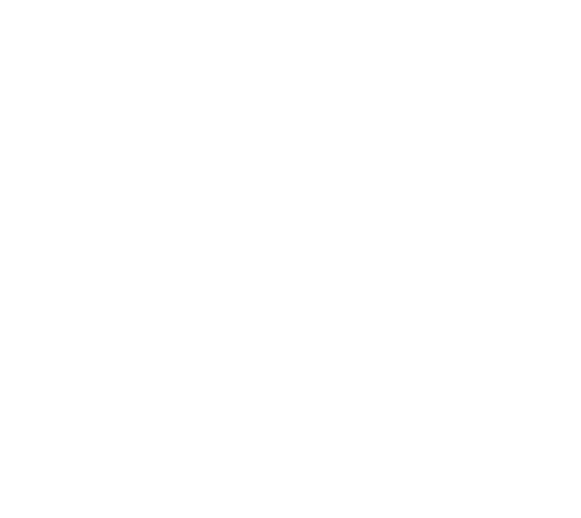

<p align="center">
  
</p>

# harp

This project includes four main packages:

 - **harp-protocol**: Provides the core protocol definitions and utilities for the Harp protocol.
   See [Protocol API Documentation](https://harp-tech.org/pyharp/api/protocol) for details.

 - **harp-serial**: Implements serial communication functionalities for generic Harp devices.
   See [Serial API Documentation](https://harp-tech.org/pyharp/api/serial) for more information.

 - **harp-device**: Implements the transport-agnostic `Device` interface, the common register map, and the shared registers and enums.
   See [Device API Documentation](https://harp-tech.org/pyharp/api/device) for details.

 - **harp-data**: Parses register binary dumps into pandas DataFrames.
   See [Data API Documentation](https://harp-tech.org/pyharp/api/data) for more information.

## Installation

All packages are published to PyPI. The `harp` package is a metadata package with no code of
its own — it just depends on the four packages above, so it's the easiest way to get everything:

```sh
pip install harp
```

```sh
uv add harp
```

If you only need part of the stack (e.g. you're parsing offline data dumps and don't need serial
I/O), install just the packages you need — each one only pulls in what it actually depends on:

| Package | Provides | Depends on |
| --- | --- | --- |
| `harp-protocol` | Core protocol types: registers, messages, payload parsing | — |
| `harp-device` | Transport-agnostic `Device` class, common register map | `harp-protocol` |
| `harp-serial` | Serial (COM/tty) transport for `Device` | `harp-protocol`, `harp-device` |
| `harp-data` | Parse register binary dumps into pandas DataFrames | `harp-protocol` |

```sh
pip install harp-protocol
pip install harp-device
pip install harp-serial
pip install harp-data
```

`harp-benchmarks` (under `src/packages/`) is internal-only and is never published to PyPI.

## Contributing

harp is a [uv workspace](https://docs.astral.sh/uv/concepts/workspaces/): every package under
`src/packages/` is its own distribution, plus the root `harp` metadata package. Contributions are
welcome — please open an issue or PR.

Clone the repo and install everything (all workspace packages, editable, plus test/lint tooling)
with the `dev` dependency group:

```sh
uv sync --group dev
```

Before opening a PR, run the same checks CI runs:

```sh
uv run ruff format --check   # formatting
uv run ruff check            # lint
uv run ty check              # type checking
uv run codespell             # spelling
uv run pytest --cov harp     # tests
```

Adding a new package? Drop it under `src/packages/<name>/` with its own `pyproject.toml`, add it
to `[tool.uv.sources]` in the root `pyproject.toml`, and (if it should ship as part of `harp`) add
it to the root package's `dependencies` too.

## Building the documentation

Install the docs dependency group and run mkdocs through uv:

```sh
uv sync --group docs --group dev
uv run mkdocs serve   # live-reloading local preview
uv run mkdocs build   # static site in ./site
```
